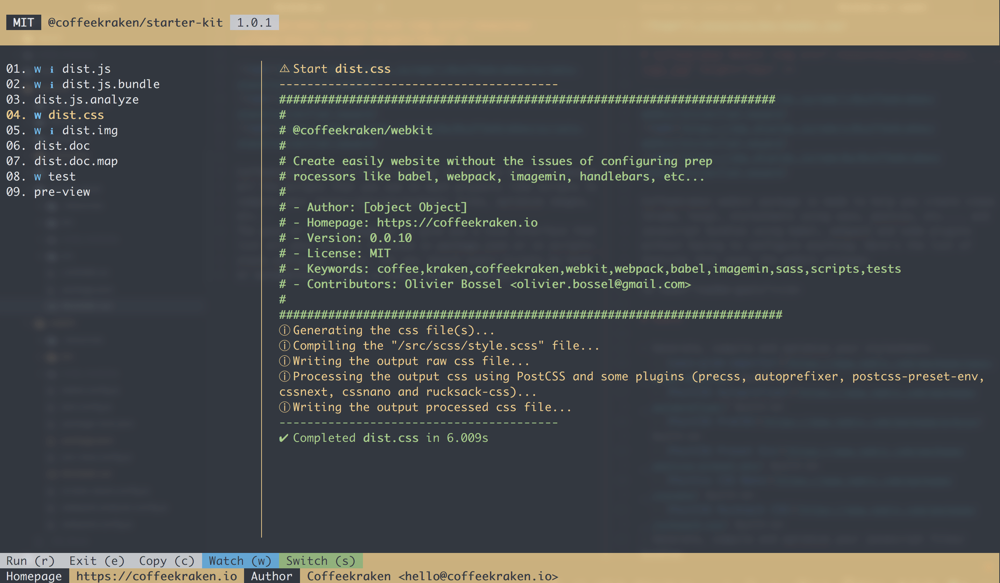

# Coffeekraken scripts stack 


Coffeekraken scripts-stack package is made to help you manage all the scripts that you use in each projects like scripts to compile your javascripts/stylesheets files, optimize images, etc...
The goal of this package is to give you a nice interface that list all your scripts (defined in package.json or in scripts-stack.config.js files), let you launch every scripts by hand or automatically using a simple watch mecanism.



<a name="readme-goals"></a>

# Goals

- Gives you a nice terminal interface that list all your scripts defines in the package.json/scripts-stack.config.js files
- Let you launch every scripts with ease by selecting it and clicking the "*e*" key
- Let you define with ease some files to watch in order to launch one of the script automatically on files update

## Table of content

1. [Goals](#readme-goals)
2. [Install](#readme-install)
3. [Quick start](#readme-quick-start)
4. [CLI](#readme-cli)
  - [CLI options](#readme-cli-options)
5. [Config](#readme-config)
6. [Coffeekraken](#readme-coffeekraken)

<a name="readme-install"></a>

# Install

To install the package, simply launch the command bellow:

```
npm i @coffeekraken/scripts-stack -save-dev
```

<a name="readme-quick-start"></a>

# Quick Start

To start using this package, you need first to list some scripts inside of your *package.json* file like so:

```JSON
{
  "name": "my-cool-project",
  "version": "1.0.0",
  "scripts": {
    "my-cool-script": "webpack ...",
    "another-script": "sass ...",
    // etc...
  },
  "dependencies": {

  },
  // etc...
}
```

Once you have defined your scripts, you can also add some *watch* patterns (glob patterns) associated with your scripts like so:

```JSON
{
  // etc...
  "scripts": {
    "my-cool-script": "webpack ...",
    "another-script": "sass ...",
    // etc...
  },
  "watch": {
    "my-cool-script": {
      "paths": "src/js/**/*.js"
    },
    "another-script": {
      "paths": "src/css/**/*.scss"
    },
    // etc...
  },
  // etc...
}
```

This will make your scripts launch themselves when your sources files are updated.

Once your configuration has been made, you just need to execute this command line:

```
coffeekraken-scripts-stack
```

<a name="readme-cli"></a>

# CLI

This package expose a CLI. Here it is:

```
coffeekraken-scripts-stack <scripts> [options]
```

This CLI has multiple options. Here's the list:

<a name="readme-cli-options"></a>

#### CLI Options

#### `-c|--color`

Specify the color that you want for the terminal interface

- default : `yellow`

#### `--config`

Specify the path to some configuration files to use. Separated by spaces

- default : null

#### `--no-watch`

If this option is specified, the watch mecanism will not be executed

- default : false

#### `--no-switch`

Do not switch automatically between the scripts when they are launched

- default : false

#### `--no-notifications`

Do not launch notifications when a script is completed, in error, etc...

- default : false

#### `-i|--ignore`

List some scripts by name to ignore in the interface. Separated by spaces

- default : null

<a name="readme-config"></a>

# Config

In order to configure your scripts-stack instance, you just need to create a ```scripts-stack.config.js``` file in your repository root folder.

Here's a ```scripts-stack.config.js``` config file sample:

```js
module.exports = {

  /**
   * This list all your scripts that you want in the scripts-stack instance.
   * @type      Object
   */
  scripts: {
    "my.cool.script": "babel ...",
    // etc...
  },

  /**
   * This specify for each scripts that you want which files need to be monitored.
   * This use the glob pattern system
   * @type        Object
   */
  watch: {
    "my.cool.script": {
      "paths": "src/js/**/*.js"
    },
    // etc...
  },

  /**
   * This specify the list of scripts that you want to ignore in the interface. Just list the scripts names.
   * @type        Array
   */
  ignore: []

};
```

<a name="readme-coffeekraken"></a>

# Coffeekraken

We are a young collective of front-end creative developers with one goal in mind. Build tools to make every team working day life better. This is our first and only concern. All our tools are build around that purpose.
All what we provide are some cool tools that you can use the way you want. These tools features cover a large scope of the front-end workflow (styleguide generation, colors/fonts management, etc...). You can use only the parts that you need and let the rest aside...

[](https://coffeekraken.io)
